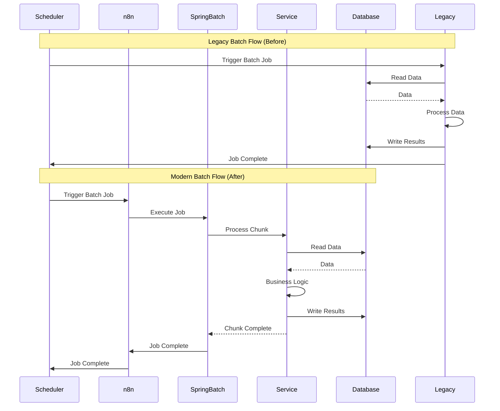

# Batch Flow Diagram

> **Icarus Nova** | Batch processing flow from COBOL to Java.

## Overview

This diagram illustrates the batch processing flow, showing how COBOL batch jobs are replaced with Java batch processing using Spring Batch.

## Batch Flow Diagram



## Batch Architecture

### Legacy Batch (COBOL)

**Components:**
- Scheduler (Control-M, OPC, etc.)
- COBOL batch programs
- JCL procedures
- Database/files

**Flow:**
1. Scheduler triggers job
2. JCL executes
3. COBOL program runs
4. Processes data
5. Updates database/files
6. Completes

### Modern Batch (Java)

**Components:**
- Scheduler (Control-M, etc.)
- n8n (orchestration)
- Spring Batch (batch framework)
- Java services (business logic)
- Database

**Flow:**
1. Scheduler triggers job
2. n8n orchestrates
3. Spring Batch executes job
4. Processes in chunks
5. Services handle business logic
6. Updates database
7. Completes

## Batch Job Structure

### Spring Batch Job Structure

```
Job: Customer Migration Job
  Step 1: Extract Customer Data
    → Reader: Read from legacy database
    → Processor: Transform data
    → Writer: Write to new database
  Step 2: Validate Customer Data
    → Reader: Read from new database
    → Processor: Validate data
    → Writer: Update validation status
  Step 3: Generate Report
    → Reader: Read validated data
    → Processor: Generate report
    → Writer: Write report file
```

## Migration Strategy

### Transition Approach

**Phase 1: Parallel Run**
- COBOL and Java run in parallel
- Compare outputs
- Validate equivalence

**Phase 2: Gradual Cutover**
- Start with low-risk jobs
- Gradually migrate jobs
- Monitor closely

**Phase 3: Full Migration**
- All jobs migrated
- COBOL decommissioned
- Java-only batch processing

## Related Documents

- [Target Architecture Java](../docs/05-target-architecture-java.md)
- [Migration Strategies](../docs/06-migration-strategies.md)
- [Batch Control-M to Spring Batch Example](../examples/batch-controlm-to-springbatch-example.md)

---

**Last Updated:** 2024  
**Maintained by:** Icarus Nova Architecture Team  
**Version:** 1.0
