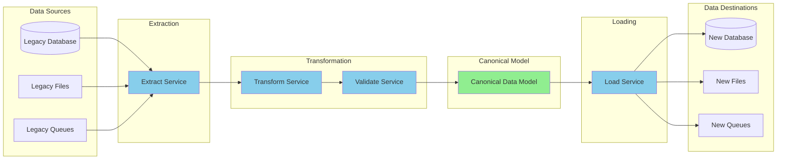

# Data Flow Diagram

> **Icarus Nova** | Data flow from COBOL systems to Java systems.

## Overview

This diagram illustrates data flow through the migration process, showing data sources, transformations, and destinations.

## Data Flow Diagram



## Data Flow Stages

### 1. Extraction

**Sources:**
- Legacy databases (DB2, IMS)
- Legacy files (VSAM, sequential)
- Legacy queues (MQ, etc.)
- Legacy APIs

**Process:**
- Read from legacy sources
- Extract data
- Handle errors
- Log extraction

### 2. Transformation

**Transformations:**
- Data type conversion
- Format conversion
- Encoding conversion (EBCDIC → UTF-8)
- Date format conversion
- Structure mapping

### 3. Validation

**Validations:**
- Data format validation
- Business rule validation
- Data quality checks
- Completeness checks

### 4. Canonical Model

**Purpose:**
- Common data model
- Format-independent
- Enables transformation
- Supports multiple formats

### 5. Loading

**Destinations:**
- New database
- New files
- New queues
- New APIs

**Process:**
- Load to destination
- Handle errors
- Validate loading
- Log results

## Data Flow Patterns

### Batch Data Flow

**Pattern:**
```
Legacy File → Extract → Transform → Validate → Load → New Database
```

### Real-Time Data Flow

**Pattern:**
```
Legacy Queue → Extract → Transform → Validate → Load → New Queue
```

### Replication Data Flow

**Pattern:**
```
Legacy Database → CDC → Transform → Validate → Load → New Database
```

## Related Documents

- [Data and Copybook Mapping](../docs/04-data-and-copybook-mapping.md)
- [Migration Strategies](../docs/06-migration-strategies.md)

---

**Last Updated:** 2024  
**Maintained by:** Icarus Nova Architecture Team  
**Version:** 1.0
