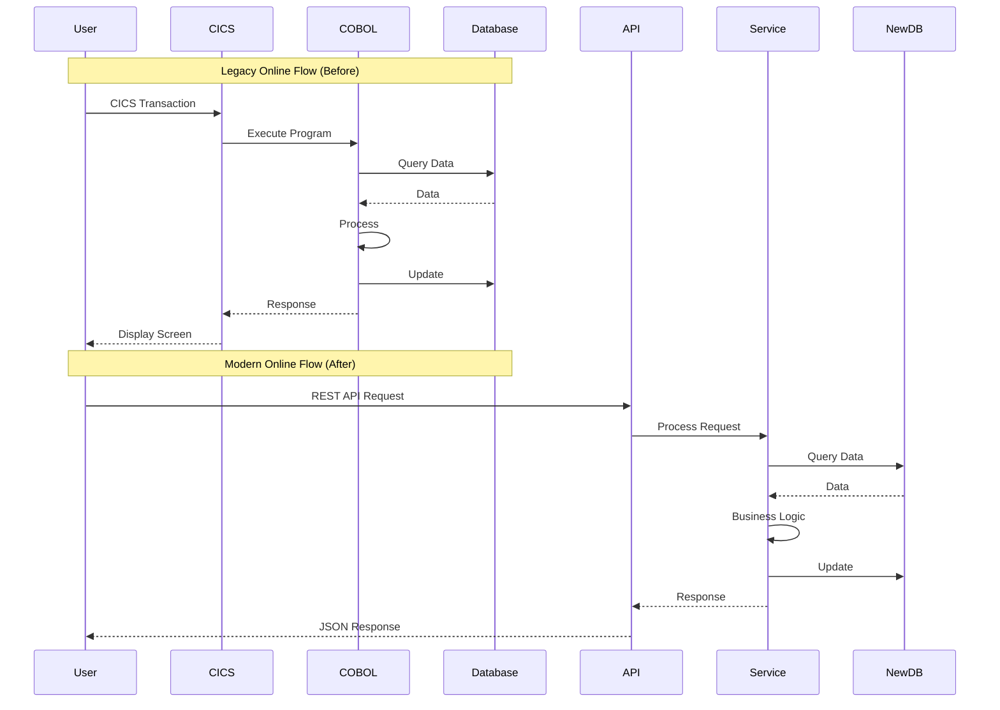

# Online Flow Diagram

> **Icarus Nova** | Online/real-time processing flow from CICS to Java REST APIs.

## Overview

This diagram illustrates how COBOL CICS transactions are replaced with Java REST APIs for online/real-time processing.

## Online Flow Diagram

## Online Architecture

### Legacy Online (CICS/COBOL)

**Components:**
- CICS transaction monitor
- COBOL programs
- 3270 screens
- Database

**Flow:**
1. User enters transaction
2. CICS routes to COBOL program
3. COBOL processes
4. Updates database
5. Returns screen data
6. CICS displays screen

### Modern Online (Java REST)

**Components:**
- API Gateway
- REST APIs
- Java services
- Database
- Frontend (web/mobile)

**Flow:**
1. User sends API request
2. API Gateway routes
3. Service processes
4. Updates database
5. Returns JSON response
6. Frontend displays

## Transaction Mapping

### CICS Transaction → REST API

**Mapping Examples:**

| CICS Transaction | REST API | Method |
|------------------|----------|--------|
| CUST | GET /api/customers/{id} | GET |
| CUPD | PUT /api/customers/{id} | PUT |
| CADD | POST /api/customers | POST |
| CDEL | DELETE /api/customers/{id} | DELETE |

## State Management

### Legacy State Management

**CICS State:**
- Conversational transactions
- Screen state
- Transaction state
- Session state

### Modern State Management

**Stateless APIs:**
- No server-side state
- Client manages state
- Token-based authentication
- Session in token

## Related Documents

- [Target Architecture Java](../docs/05-target-architecture-java.md)
- [Implementation Guidelines](../docs/07-implementation-guidelines.md)

---

**Last Updated:** 2024  
**Maintained by:** Icarus Nova Architecture Team  
**Version:** 1.0
