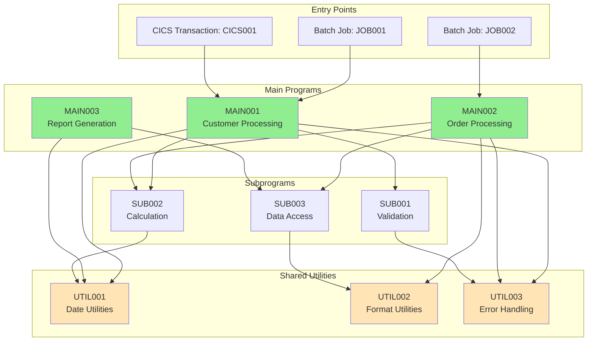

# Program Call Graph

> **Icarus Nova** | Call graph diagram showing COBOL program relationships.

## Overview

This diagram illustrates the call relationships between COBOL programs, showing entry points, subprograms, and shared utilities.

## Call Graph Diagram

## Call Graph Analysis

### Entry Points

**Batch Jobs:**
- JOB001: Customer processing batch job
- JOB002: Order processing batch job

**Online Transactions:**
- CICS001: Customer inquiry transaction

### Main Programs

**MAIN001: Customer Processing**
- Called by: JOB001, CICS001
- Calls: SUB001, SUB002, UTIL001, UTIL003
- Purpose: Main customer processing logic

**MAIN002: Order Processing**
- Called by: JOB002
- Calls: SUB002, SUB003, UTIL002, UTIL003
- Purpose: Main order processing logic

**MAIN003: Report Generation**
- Called by: JOB003
- Calls: SUB003, UTIL001
- Purpose: Report generation

### Subprograms

**SUB001: Validation**
- Called by: MAIN001
- Calls: UTIL003
- Purpose: Data validation

**SUB002: Calculation**
- Called by: MAIN001, MAIN002
- Calls: UTIL001
- Purpose: Business calculations

**SUB003: Data Access**
- Called by: MAIN002, MAIN003
- Calls: UTIL002
- Purpose: Database access

### Shared Utilities

**UTIL001: Date Utilities**
- Called by: MAIN001, MAIN003, SUB002
- Purpose: Date manipulation

**UTIL002: Format Utilities**
- Called by: MAIN002, SUB003
- Purpose: Data formatting

**UTIL003: Error Handling**
- Called by: MAIN001, MAIN002, SUB001
- Purpose: Error handling

## Migration Implications

### Migration Order

**Phase 1: Utilities**
- Migrate shared utilities first
- Foundation for other programs
- Low risk, high reuse

**Phase 2: Subprograms**
- Migrate subprograms
- Used by main programs
- Medium risk

**Phase 3: Main Programs**
- Migrate main programs
- Depend on utilities and subprograms
- Higher risk

### Dependency Management

**Critical Dependencies:**
- UTIL003 (Error Handling) used by many programs
- Must migrate early
- High impact if changes

**Shared Components:**
- Utilities shared across programs
- Changes affect multiple programs
- Careful versioning needed

## Related Documents

- [COBOL Application Analysis](../docs/03-cobol-application-analysis.md)
- [Migration Strategies](../docs/06-migration-strategies.md)

---

**Last Updated:** 2024  
**Maintained by:** Icarus Nova Architecture Team  
**Version:** 1.0
